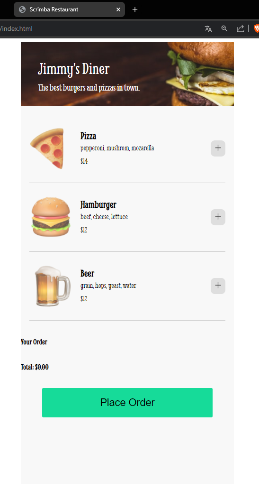
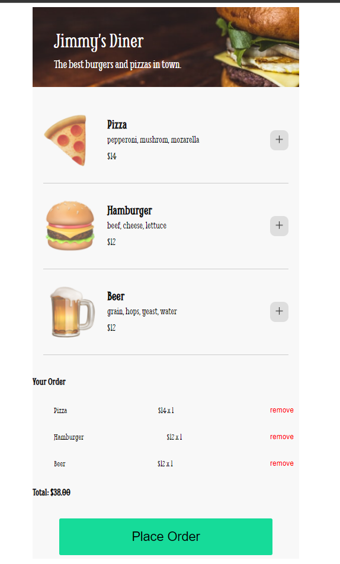
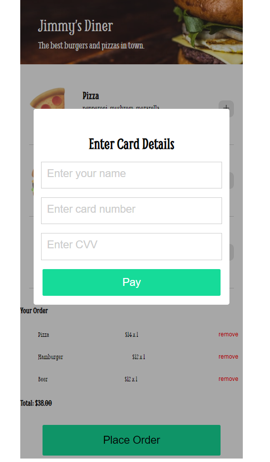
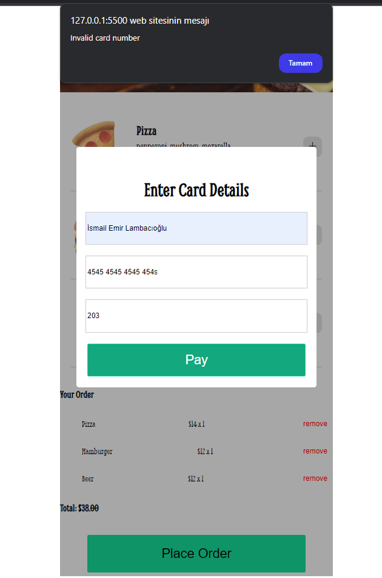
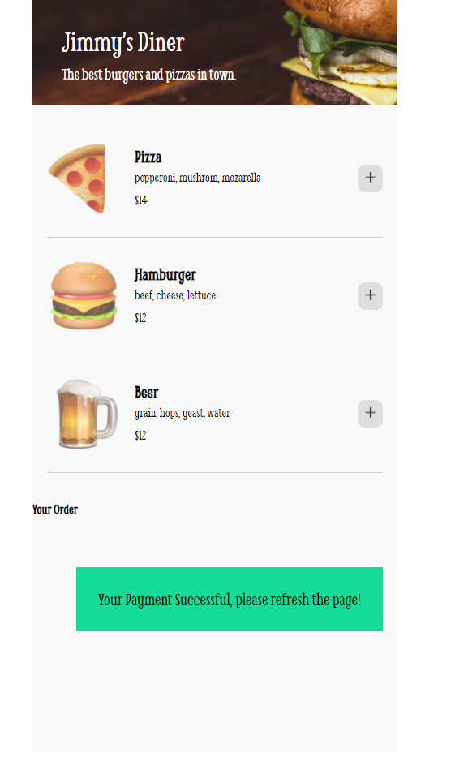

Sure, here's a sample README file for your restaurant menu web application:

---

# Jimmy's Diner Web Application for Scrimba

## Overview

This project is a simple web application for Jimmy's Diner, showcasing a restaurant menu. It allows users to view different meal items, add them to their order, and proceed to a mock payment page. The application is built using HTML, CSS, and JavaScript.

## Features

- Display of meal items with images, names, ingredients, and prices.
- Ability to add items to the order.
- Display of the total cost of the order.
- Mock payment form to enter card details.
- Validation of card details input.
- Confirmation message upon successful payment.

## Technologies Used

- HTML
- CSS
- JavaScript

## Screenshots

### Main Menu Page


### Order Summary


### Payment Form


### Card Details Validation


### Payment Success


## How to Use

1. **Clone the repository:**
   ```bash
   git clone https://github.com/yourusername/restaurant-ordering-app-scrimba.git
   ```
2. **Navigate to the project directory:**
   ```bash
   cd restaurant-ordering-app-scrimba
   ```
3. **Open the `index.html` file in your browser to view the application:**
   ```bash
   open index.html
   ```
   
## File Structure

- `index.html` - The main HTML file that contains the structure of the web application.
- `styles.css` - The CSS file that contains styles for the web application.
- `script.js` - The JavaScript file that contains the functionality for the web application.

## Functionality

- **Adding Items to the Order:**
  - Click on the `+` button next to a meal item to add it to the order.
  - The order summary will be updated with the selected items and their quantities.
  - The total cost will be calculated and displayed.

- **Removing Items from the Order:**
  - Click on the `remove` link next to an item in the order summary to remove it from the order.

- **Proceeding to Payment:**
  - Click on the `Place Order` button to open the payment form.
  - Enter the card details (name, card number, and CVV) in the form.
  - Click the `Pay` button to validate the card details and display a confirmation message.

## Validation

- The card number input requires a valid card number format.
- The CVV input requires a valid CVV format.

## License

This project is licensed under the MIT License. See the [LICENSE](LICENSE) file for more details.

## Acknowledgments

- Made by İsmail Emir Lambacıoğlu for the Scrimba Frontend Developer Career Path course.

---

You can replace the placeholder URLs and paths with the actual ones related to your project.